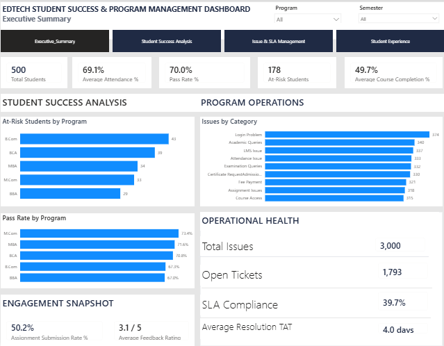
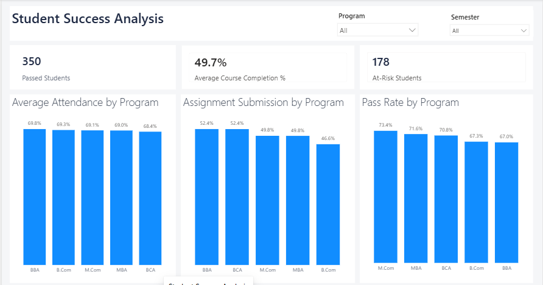
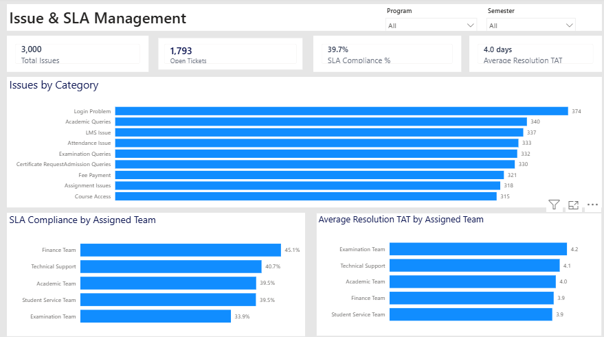
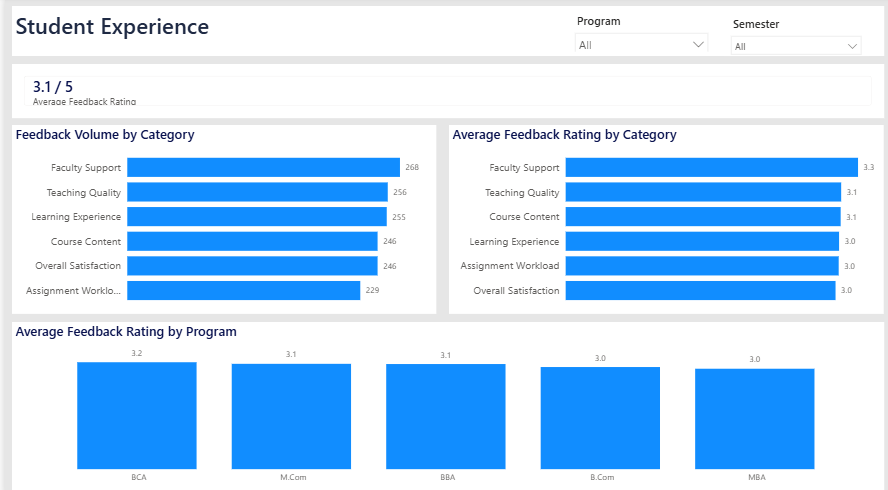

# EdSuccess Analytics
### Student Success & Program Management Platform

**Program Management | Data Analytics | Agile Delivery**

EdSuccess Analytics is an end-to-end EdTech program management and student success analytics project that integrates data preparation, analytical reporting, program governance, Agile execution, and management decision support.

The solution consolidates student, academic, faculty, support, and feedback data into a structured analytical platform and uses Power BI to provide management visibility into student success, engagement, service performance, and student experience.

The project demonstrates how a Program Manager can move beyond KPI reporting by translating analytical findings into structured management insights, investigation areas, ownership, and recommended actions.

> **Note:** This is a portfolio project developed using synthetic data. It does not contain real student or institutional information.

## Project at a Glance

| Metric | Project Scope |
|---|---:|
| Students | 500 |
| Interconnected Datasets | 9 |
| Power BI Report Pages | 4 |
| Jira Epics | 5 |
| Features / User Stories | 14 |
| Story Points | 95 |
| Planned Sprints | 3 |

## Business Problem

EdTech programs generate data across academic performance, attendance, assignments, student support, faculty operations, and student feedback. When these data points are managed separately, Program Managers may lack a consolidated view of student success and operational performance.

EdSuccess Analytics was designed to create a centralized analytical and program-management framework that enables management to:

- Monitor student success and engagement indicators.
- Identify students requiring additional attention or intervention.
- Track support issues, unresolved ticket backlog, SLA compliance, and resolution turnaround time.
- Analyze student feedback and experience indicators.
- Compare performance across programs and semesters.
- Translate KPI findings into structured management actions and ownership.

## Project Objectives

The project was developed with the following objectives:

- Build and validate a structured analytical database covering key EdTech operational and academic areas.
- Develop a relational Power BI data model for cross-functional analysis.
- Create management dashboards covering student success, support operations, and student experience.
- Establish measurable KPIs for academic, engagement, and service performance.
- Apply program-management governance through a Project Charter, RACI Matrix, and Risk & Issue Register.
- Structure project delivery using Agile practices and Jira.
- Convert analytical findings into management insights, investigation areas, recommended actions, ownership, priorities, and success measures.

## Solution Architecture

EdSuccess Analytics follows an end-to-end workflow that connects data preparation, analytical reporting, management decision support, and project governance.

### Project Workflow

**Synthetic EdTech Data**  
↓  
**Python & Jupyter Notebook — Data Generation and Preparation**  
↓  
**Excel — Consolidated Analytical Database**  
↓  
**Power BI — Data Modeling, DAX Measures and Dashboard Reporting**  
↓  
**KPI Analysis — Student Success, Engagement, Support Operations and Experience**  
↓  
**Management Insights & Action Planning**  
↓  
**Program Governance — Charter, RACI, Risk & Issue Management**  
↓  
**Agile Delivery Management — Jira Epics, Features/User Stories, Story Points, Planned Sprints and Subtasks**

### Technology Stack

| Area | Tools / Methods |
|---|---|
| Data Generation & Preparation | Python, Pandas, Jupyter Notebook |
| Data Storage & Validation | Microsoft Excel |
| Data Modeling & Analytics | Power BI, DAX |
| Dashboard Reporting | Power BI |
| Agile Work Management | Jira |
| Project Governance | Project Charter, RACI Matrix, Risk & Issue Register |
| Agile Planning | Epics, Features/User Stories, Acceptance Criteria, Story Points, Planned Sprints, Subtasks |
| Management Decision Support | KPI Analysis, Management Insights & Action Plan |

## Dataset & Data Model

The analytical database contains **9 interconnected datasets** designed to represent key academic, engagement, operational, faculty, and student-experience areas within an EdTech environment.

| Dataset | Records | Purpose |
|---|---:|---|
| Student_Master | 500 | Central student profile, program, semester, engagement, completion, and risk information |
| Faculty_Master | 100 | Faculty profile, department, qualification, experience, subject, and rating information |
| Course_Master | 30 | Course, program, department, semester, credits, course type, and faculty allocation |
| Attendance_Master | 3,000 | Subject-level attendance and attendance-performance tracking |
| Assignment_Master | 3,000 | Student assignment submission and engagement tracking |
| Issue_Tracker | 3,000 | Student-support issues, ticket status, SLA, resolution, category, and assigned-team analysis |
| Exam_Master_Data | 3,000 | Student examination-level academic performance data |
| Result_Master_Data | 500 | Consolidated student-level academic result and pass/fail outcomes |
| Student_Feedback_Master | 1,500 | Student feedback and experience analysis |

### Data Model

`Student_Master` serves as the central student-level reference for analytical reporting. Related academic, engagement, support, result, and feedback datasets are connected through appropriate identifiers, enabling consistent analysis across students, programs, semesters, and operational areas.

The Power BI model was validated to ensure that relationships and filter interactions produced consistent KPI results across the reporting pages.

### Data Quality & Validation

Before dashboard development, the project included validation of:

- Key identifiers and data types
- Missing and duplicate records
- Cross-table consistency
- Program and semester business rules
- Academic-result logic
- Table relationships and cardinality
- Cross-table filtering behavior
- KPI outputs against the validated source data

During validation, unrealistic academic-result generation and incomplete undergraduate semester representation were identified and corrected before final reporting.

## Power BI Dashboard

A four-page Power BI dashboard was developed to provide management-level visibility across student success, academic engagement, support operations, and student experience.

### Dashboard Pages

| Dashboard Page | Management Purpose |
|---|---|
| Executive Summary | Provides a consolidated view of key student-success, engagement, support, and experience KPIs |
| Student Success Analysis | Analyzes attendance, academic performance, assignment submission, course completion, and student risk |
| Issue & SLA Management | Monitors support issue volume, unresolved backlog, SLA compliance, resolution TAT, issue categories, and assigned teams |
| Student Experience | Analyzes student feedback and experience indicators |

Program and Semester slicers were configured and validated to support interactive analysis across relevant dashboard visuals.

### Key Performance Indicators

| KPI | Final Result |
|---|---:|
| Total Students | 500 |
| Average Attendance | 69.1% |
| Pass Rate | 70.0% |
| Assignment Submission Rate | 50.2% |
| At-Risk Students | 157 |
| Average Course Completion | 50.6% |
| Average Feedback Rating | 3.1 / 5 |
| SLA Compliance | 39.7% |
| Open Tickets | 1,793 |
| Average Resolution TAT | 4.0 days |
| Total Issues | 3,000 |

### Key Management Findings

The dashboard highlighted several areas requiring management attention:

- **31.4% of students were classified as high risk**, creating a priority population for academic and student-support intervention.
- **Average attendance was 69.1%**, below the 75% threshold used in the project's attendance logic.
- **Assignment submission was 50.2%**, indicating an opportunity to improve student engagement and academic follow-up.
- **The overall pass rate was 70.0%**, leaving a 30% non-passing group for further performance analysis and targeted academic support.
- **SLA compliance was 39.7%**, indicating a substantial opportunity to improve service-performance adherence.
- **1,793 of 3,000 support issues remained open**, representing approximately 59.8% of the support issue volume and indicating a substantial unresolved backlog.

These findings were subsequently translated into a structured **Management Insights & Action Plan** containing investigation areas, recommended actions, ownership, priorities, and success measures.

### Executive Summary


### Student Success Analysis


### Issue & SLA Management


### Student Experience


## Program Management & Governance

The project incorporated formal program-management practices alongside analytics development to ensure that scope, responsibilities, risks, issues, and management actions were structured and traceable throughout the project lifecycle.

### Project Management Artifacts

| Artifact | Purpose |
|---|---|
| Project Charter | Defined project objectives, scope, stakeholders, deliverables, assumptions, constraints, and success criteria |
| RACI Matrix | Defined responsibility and accountability across key project activities |
| Risk & Issue Register | Tracked project risks, operational issues, management responses, ownership, and status |
| Agile Product Backlog | Structured project requirements through Epics, Features/User Stories, priorities, acceptance criteria, story points, and planned sprints |
| Management Insights & Action Plan | Converted KPI findings into investigation areas, recommended actions, ownership, priorities, and success measures |
| Project Closure Report | Documented delivered scope, KPI outcomes, management insights, risks and issues, Agile execution, lessons learned, limitations, future enhancements, and formal project closure |

### Risk & Issue Management

The project maintained a structured Risk & Issue Register to distinguish potential project risks from observed operational issues.

Key areas included:

- Data quality and KPI reliability
- Potential impact of data-structure changes on analytical reporting
- Limited historical data for trend analysis and forecasting
- Student intervention capacity associated with high-risk populations
- High unresolved support-ticket backlog
- Low SLA compliance
- Assignment-submission performance
- High-risk student population

Data and reporting risks were addressed through validation, structured modeling, and dashboard QA. Operational issues were documented for continued management intervention and monitoring.

### Management Action Planning

Dashboard findings were translated into a structured Management Insights & Action Plan rather than ending the project at KPI reporting.

For each significant management finding, the action plan documented:

- KPI evidence
- Management observation
- Investigation required
- Recommended action
- Responsible owner
- Priority
- Success measure
- Current status

This created a direct connection between **analytics, management decision-making, accountability, and future intervention tracking**.

## Agile & Jira Implementation

The project was structured in Jira using Agile project-management practices to organize requirements, define acceptance criteria, estimate relative effort, track implementation activities, and maintain visibility into project completion.

### Agile Delivery Structure

| Agile Element | Implementation |
|---|---:|
| Epics | 5 |
| Features / User Stories | 14 |
| Total Story Points | 95 |
| Planned Sprints | 3 |
| Acceptance Criteria | Defined for each Feature / User Story |
| Implementation Subtasks | Created under relevant Features / User Stories |
| Workflow | To Do → In Progress → In Review → Done |

### Epic Structure

| Epic | Features / User Stories | Story Points |
|---|---:|---:|
| Data Foundation & Quality | 3 | 21 |
| Student Success Analytics | 3 | 24 |
| Issue & SLA Management | 3 | 21 |
| Student Experience Analytics | 2 | 11 |
| Program Governance & Management Insights | 3 | 18 |
| **Total** | **14** | **95** |

### Planned Sprint Structure

| Planned Sprint | Focus | Features / User Stories | Story Points |
|---|---|---:|---:|
| Sprint 1 | Data Foundation & KPI Definition | 3 | 21 |
| Sprint 2 | Analytics & Dashboard Development | 8 | 56 |
| Sprint 3 | Governance & Management Insights | 3 | 18 |
| **Total** |  | **14** | **95** |

### Jira Work-Item Hierarchy

The Jira environment used the following hierarchy:

**Epic → Feature → Subtask**

Features represented the project's User Stories and included:

- User need and business purpose
- Acceptance criteria
- Priority
- Story-point estimate
- Planned sprint
- Workflow status
- Relevant implementation subtasks

This structure connected high-level program objectives with the implementation work required to deliver the analytical and governance components of the project.

All **14 Features/User Stories** and their required project-delivery activities were completed following final deliverable QA and project closure.

## Challenges & Lessons Learned

The project required iterative problem-solving across data generation, business-rule validation, analytical modeling, scope management, and Agile implementation.

| Challenge | Resolution | Lesson Learned |
|---|---|---|
| Initial academic-result generation produced an unrealistic pass rate | Redesigned student-level performance-generation logic to produce a more realistic analytical dataset | KPI outputs should be validated for business realism, not only technical correctness |
| Undergraduate semester data did not fully represent the six-semester program structure | Corrected semester data while preserving the existing project workflow | Business rules should be validated before downstream reporting is finalized |
| Relationships across multiple academic, engagement, support, faculty, and feedback datasets required careful modeling | Established and tested Power BI relationships and cross-table filtering behavior | A reliable analytical model is essential before interpreting dashboard KPIs |
| Some dataset structures were intentionally simplified to maintain project momentum | Deferred deeper Program → Semester → Subject → Faculty mapping to a future enhancement phase | Effective scope control can be more valuable than continuously expanding requirements |
| Dashboard KPIs alone did not provide sufficient management direction | Developed a Management Insights & Action Plan connecting KPI evidence to investigation, action, ownership, and success measures | Analytics becomes more valuable when findings are translated into management actions |
| Agile/Jira concepts required practical implementation | Structured actual project work through Epics, Features/User Stories, acceptance criteria, story points, planned sprints, statuses, and subtasks | Agile artifacts are most useful when they represent real project work rather than documentation created only for presentation |

## Limitations & Future Enhancements

The current project intentionally prioritizes completion of a usable end-to-end solution over continuously expanding analytical complexity.

Future iterations could include:

- Develop detailed **Program → Semester → Subject** curriculum mapping.
- Introduce demand-based faculty allocation by program, department, and subject.
- Apply deeper academic rules to attendance and assignment data generation.
- Add historical and term-wise data for trend analysis, cohort comparison, and forecasting.
- Develop a more advanced student early-warning model using multiple academic, engagement, and support indicators.
- Track management interventions over time and measure KPI changes before and after implementation.
- Connect the analytical solution to regularly refreshed source systems and establish automated reporting processes.

These items represent a **future development roadmap rather than unresolved defects in the completed project**.

## Repository Structure

```text
EdSuccess-Analytics/
│
├── README.md
│
├── data/
│   └── EdTech_Program_Management_Database.xlsx
│
├── notebooks/
│   └── EdSuccess_Data_Generation_Analysis.ipynb
│
├── powerbi/
│   ├── EdSuccess_Analytics.pbix
│   └── dashboard-screenshots/
│       ├── executive-summary.png
│       ├── student-success.png
│       ├── issue-sla-management.png
│       └── student-experience.png
│
├── project-management/
│   ├── Project_Charter.pdf
│   ├── RACI_Matrix.xlsx
│   ├── Risk_Issue_Register.xlsx
│   ├── Agile_Product_Backlog.xlsx
│   ├── Management_Insights_Action_Plan.xlsx
│   └── Project_Closure_Report.pdf
│
├── jira-screenshots/
│   ├── jira-agile-structure.png
│   └── jira-feature-example.png
│
└── docs/
    └── EdSuccess_Portfolio_Summary.pdf

## Skills Demonstrated

Through EdSuccess Analytics, the project demonstrates practical application of:

- Program and project planning
- Scope and deliverable management
- Agile project management
- Jira backlog and work-item management
- Risk and issue management
- RACI and responsibility planning
- Student success analytics
- Service and SLA management
- KPI development and performance monitoring
- Power BI data modeling and dashboard development
- Data quality and business-rule validation
- Management insight and action planning
- Project quality assurance and closure

## Project Status

**Status: Completed**

The defined project scope, analytical solution, Power BI dashboards, program-management artifacts, Agile/Jira implementation, Management Insights & Action Plan, project documentation, and final quality-assurance review have been completed.

Operational interventions identified through the analysis remain open for future implementation, while additional opportunities for improving data realism, historical analysis, intervention tracking, and automation are documented as future enhancements.

## Data & Portfolio Disclaimer

EdSuccess Analytics is an independent portfolio project created to demonstrate program-management, analytics, and Agile delivery capabilities in an EdTech scenario.

All student, faculty, academic, support, and feedback data used in this project are **synthetically generated for demonstration purposes**. The repository does not contain real student records, institutional data, or personally identifiable information.
